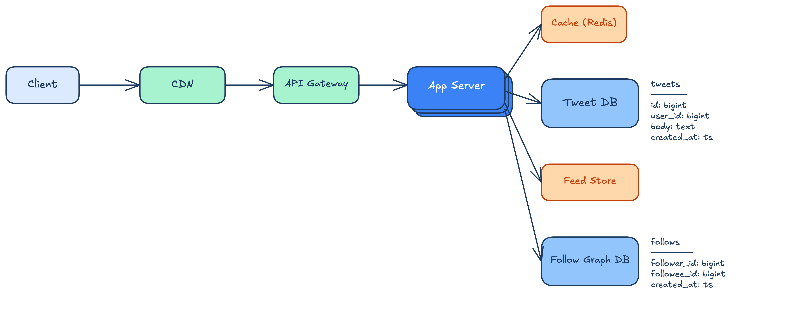
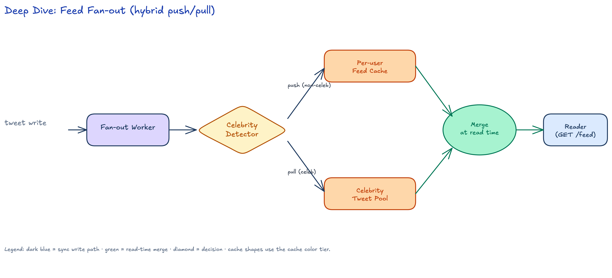
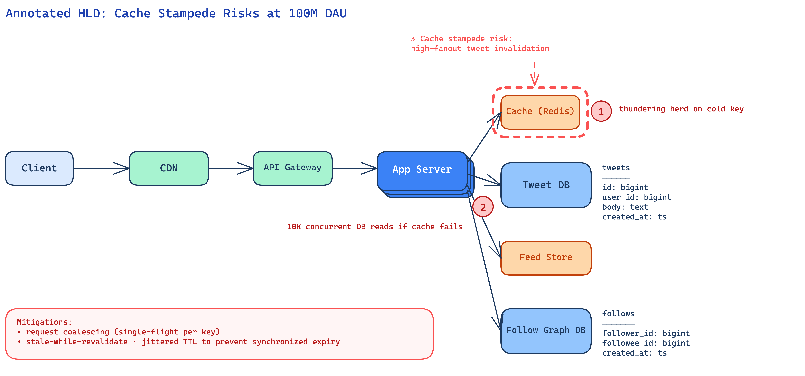
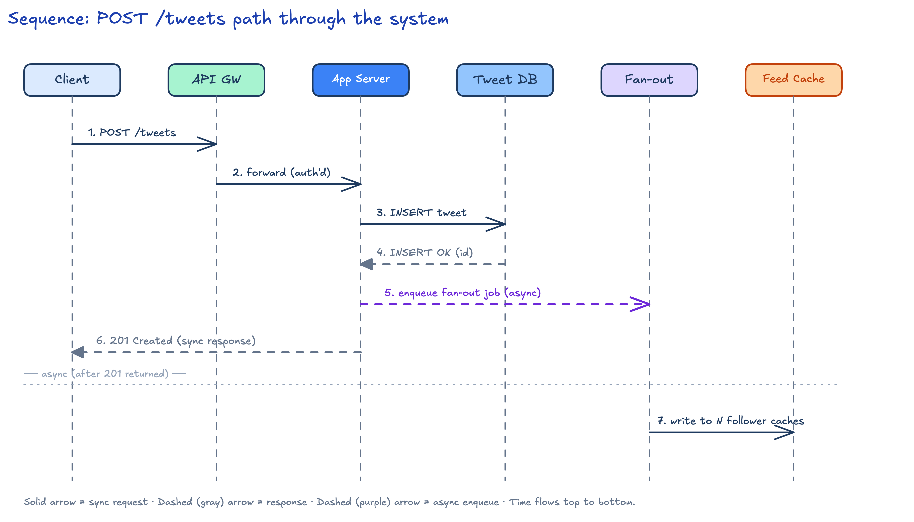

# Twitter Feed — System Design

A worked example illustrating the HelloInterview 6-phase Delivery framework end-to-end. Phase 4 (Data Flow) is intentionally skipped because Twitter feed is a request/response system, not a data-processing pipeline. The Phase 6 deep dives are deliberately chosen to exercise all three deep-dive diagram types (zoom-in, annotated-HLD, sequence) so this directory doubles as a few-shot reference for the skill.

## Requirements

### Functional

1. Users can post a tweet (short text body).
2. Users can follow another user.
3. Users can view their personalized home feed (most recent tweets from people they follow).
4. Users can like a tweet.
5. Users can view a profile (the tweets posted by a single user).

### Non-Functional

1. Low feed read latency: p99 `< 200ms`. The feed is the most-used surface and drives engagement.
2. High availability: 99.99% on the read path. Posting may degrade gracefully; reading must not.
3. Scale to 100M DAU.
4. Eventual consistency is acceptable for the feed (a tweet appearing a few seconds late on a follower's feed is fine). Strong consistency is required only for follow/unfollow visibility on the actor's own session.

### Capacity Estimation

- Tweet write rate: 100M DAU × 2 tweets/day ≈ **2,300 writes/sec sustained**, peak ~5× that.
- Fan-out amplification: median follower count ≈ 200 → each tweet write triggers ~200 cache writes to follower feed caches → sustained fan-out write rate ≈ **460K writes/sec**. This is the dominant cost driver of the architecture.
- Storage: tweets are tiny (<1 KB body + metadata). Even at 200M tweets/day × 1 KB × 365 days ≈ 73 TB/year — comfortable on commodity sharded SQL. **Skip cost annotations** — storage is not the design driver here.
- Long-tail: celebrity users (>1M followers) make naive fan-out catastrophic. This drives the hybrid push/pull design (see deep dive #1).

## Core Entities

- **User** — account identity.
- **Tweet** — a post by a user.
- **Follow** — directed edge: follower → followee.
- **Feed** — materialized list of tweet IDs ordered by recency, scoped to one viewing user.

## API

All endpoints authenticate via the `Authorization` header (bearer token); never via the request body.

| Method | Path | Body | Response |
|---|---|---|---|
| `POST` | `/tweets` | `{ "body": string }` | `201 { "id": tweet_id }` |
| `POST` | `/follows` | `{ "followee_id": user_id }` | `201` |
| `GET` | `/feed?cursor=<opaque>&limit=20` | — | `200 { "tweets": [...], "next_cursor": opaque }` |
| `GET` | `/users/{id}` | — | `200 { "user": {...}, "recent_tweets": [...] }` |
| `POST` | `/tweets/{id}/likes` | — | `201` |

Pagination is cursor-based (opaque cursors, not offsets) to stay correct as the feed grows.

## Data Flow

**Phase 4 (Data Flow) skipped — Twitter feed is a request/response system, not a data-processing pipeline.** The framework reserves Phase 4 for analytics / ML inference / ETL / transcoding / search-indexing pipelines. Request/response paths are documented adequately by the API section (Phase 3) and the HLD prose (Phase 5). The async fan-out worker is a single async hop, not a pipeline, and is fully captured by the Phase 5 HLD plus the Phase 6 deep dives.

## High-Level Design

The HLD shows the standard request path:

1. **Client** (web or mobile) talks to the **CDN** for static assets and tweet media. The CDN absorbs the bulk of read bandwidth that does not require auth — avatar images, JS bundles, embedded media.
2. **API Gateway** terminates TLS, authenticates the bearer token, applies per-user rate limits, and forwards to the application tier.
3. **App Server** (stateless, horizontally scaled — depicted as stacked instances) handles business logic: validation, authorization, orchestration of the data tier.
4. The **Cache** (Redis) sits in front of the primary tweet store and serves hot reads (recent tweets by a user, profile metadata).
5. The **Tweet DB** (sharded SQL by `user_id`) is the source of truth for tweet content. Schema: `id`, `user_id`, `body`, `created_at`.
6. The **Feed Store** (Redis sorted-set per user) is a precomputed cache of `tweet_id` lists, materialized by the fan-out worker on each tweet write. Reading the feed is one O(log N) sorted-set lookup; this is what hits the `< 200 ms` p99 budget.
7. The **Follow Graph DB** stores edges. Schema: `follower_id`, `followee_id`, `created_at`. It is read at fan-out time to find a tweet author's followers, and at follow/unfollow time to mutate edges.

**Write path summary** (full sequence in deep dive #3): tweet write → API GW → App → Tweet DB (durable) → enqueue async fan-out job → respond 201 immediately. Fan-out worker reads the follow graph and writes to N follower feed caches asynchronously.

**Read path summary**: feed request → API GW → App → Feed Store sorted-set lookup (N tweet IDs) → batched Tweet DB / Cache lookup to hydrate tweet bodies → return.

## Deep Dives

Three deep dives, each chosen to address one non-functional requirement and to exercise one of the three diagram types per `deep-dive-rules.md`.

### Feed fan-out

Naive push fan-out (write to every follower's feed cache on each tweet) breaks for celebrity users with millions of followers — a single tweet would trigger millions of cache writes. The hybrid scheme: a **Celebrity Detector** branches at fan-out time. Non-celebrity tweets take the **push path** — the fan-out worker writes to each follower's per-user feed cache. Celebrity tweets take the **pull path** — they land in a per-celebrity tweet pool, and feed reads merge the per-user feed cache with the celebrity pools of users the reader follows. This is a ZOOM-IN diagram because it introduces new internal components (Fan-out Worker, Celebrity Detector, Celebrity Tweet Pool, merge step) not visible on the HLD.

### Cache stampede risks

At 100M DAU read volume, a single cold or invalidated hot key (e.g., a celebrity's profile cache) can stampede the database with thousands of concurrent reads when the cache misses simultaneously. The annotated HLD marks two specific hot spots: ① thundering-herd on cold keys at the Cache, and ② up to ~10K concurrent DB reads if the Cache fails. Mitigations called out on the diagram: request coalescing (single-flight per key), stale-while-revalidate, and jittered TTLs to prevent synchronized expiry. This is an ANNOTATED-HLD diagram because it adds callouts only — no new components are introduced.

### Tweet post path

The temporal lifecycle of a `POST /tweets` request, hop by hop. The synchronous portion (Client → API GW → App Server → Tweet DB → 201 Created back to Client) is bounded by the user-perceived latency budget. The fan-out work is enqueued before the 201 response and runs asynchronously: the Fan-out Worker dequeues the job, reads the follow graph, and writes to N follower feed caches in parallel. This is a SEQUENCE diagram because the dominant feature is temporal flow ("first A, then B, then C in order").
